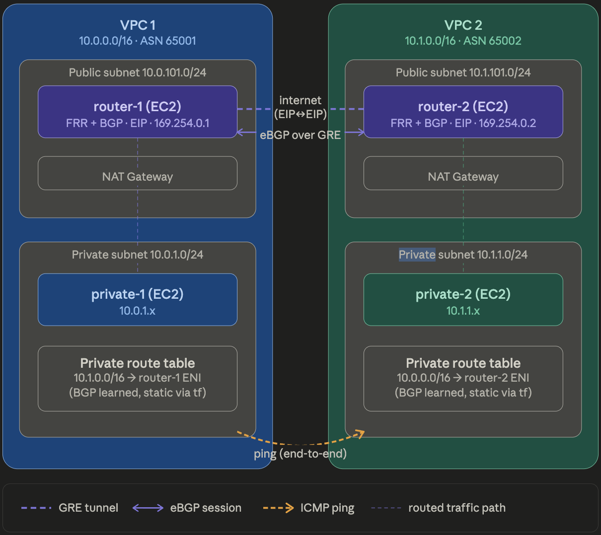

# aws-bgp-routing-terraform

A two-VPC AWS network where routing between private instances is handled by BGP — not VPC Peering or Transit Gateway. Each VPC has a software router (EC2 running FRR) that builds a GRE tunnel to the other router, runs eBGP over that tunnel, and advertises its VPC's CIDR. Private instances in each VPC can ping each other across VPCs entirely through BGP-learned routes.

## Architecture



**Traffic flow:** private-1 → router-1 (BGP learned route) → GRE tunnel → router-2 → private-2

## Resources Created

- **2 VPCs** — `10.0.0.0/16` and `10.1.0.0/16`, each with one public and one private subnet
- **2 NAT Gateways** — one per VPC for private subnet outbound internet access
- **2 Router EC2s** — Amazon Linux 2 instances running FRR, placed in public subnets with Elastic IPs
- **2 Private EC2s** — in private subnets, used to verify end-to-end BGP routing
- **4 Elastic IPs** — two for routers, two for NAT Gateways
- **GRE Tunnel** — virtual point-to-point link between routers over the public internet
- **eBGP Session** — between router-1 (ASN 65001) and router-2 (ASN 65002) over the GRE tunnel
- **Security Groups** — SSH/ICMP for routers and private instances, BGP/GRE locked to peer EIP only
- **Remote State** — split across two S3 backends (network and compute layers)

## Why BGP + GRE instead of VPC Peering?

VPC Peering and Transit Gateway are the standard AWS-managed solutions for inter-VPC connectivity — but they abstract away all the routing complexity. This project deliberately takes the harder path: building inter-VPC routing from scratch using eBGP between autonomous systems, the same way real service providers and enterprise networks handle inter-domain routing.

GRE tunnels provide a Layer 3 path between the two routers so BGP can peer without direct Layer 2 adjacency — simulating how routing works between independently managed networks.

This approach was chosen to:
- Work with protocols (BGP, GRE) that are transferable to on-premises and hybrid environments
- Understand what AWS abstracts away when you use VPC Peering or TGW
- Build something more technically challenging than a point-and-click AWS solution

## Key Technical Decisions

**EIPs allocated before EC2 creation**
Avoids a dependency cycle — each router's `user_data` needs the peer's public IP at creation time. Auto-assigned IPs are only known after the instance exists. EIPs are allocated first as independent resources, breaking the cycle.

**GRE tunnel between EIPs, not private IPs**
Private IPs are not routable between separate VPCs without peering. EIPs are public and reachable across the internet, making them the only viable GRE tunnel endpoints in this setup.

**BGP over link-local IPs (`169.254.x.x`)**
Standard practice for point-to-point BGP sessions. The tunnel interface gets a link-local address on each end — no need for a routable subnet just for BGP peering.

**BGP/GRE security groups outside the module**
SG rules need the peer router's EIP to lock down port 179 and protocol 47. A module can't reference a resource that doesn't exist yet. Keeping these SGs outside the module lets Terraform resolve the order correctly — EIPs first, then SGs, then EC2s.

**`source_dest_check = false` on routers**
AWS drops packets where the source or destination IP doesn't match the instance's own IP. Routers forward traffic destined for other instances, so this check must be disabled.

**`templatefile()` for user_data**
Both routers run identical logic but with mirrored values — peer IP, ASNs, CIDRs. A single template with variables avoids duplicating the script and makes the differences between routers explicit.

**Split Terraform state (network/ + compute/)**
Network is stable infrastructure that rarely changes. Compute changes more often. Separate state means a compute change can't accidentally destroy VPCs, and each layer can be managed independently.

**`mgmtd` removed from FRR daemons**
FRR's management daemon crashes on Amazon Linux 2. Removing it via `sed` in user_data is the known community fix — without this the entire FRR stack fails to start.


## Project Structure

```
aws-bgp-routing-terraform/
├── .gitignore
├── README.md
│
├── network/                          # Layer 1: VPCs, subnets, route tables
│   ├── vpc.tf
│   ├── outputs.tf                    # Exports VPC IDs, CIDRs, subnet IDs for compute layer
│   ├── variables.tf
│   ├── versions.tf
│   ├── backend.conf.example
│   └── network.auto.tfvars.example
│
├── compute/                          # Layer 2: EC2, EIPs, SGs, BGP routes
│   ├── ec2.tf                        # Router and private instances
│   ├── sg.tf                         # All security groups (module SGs + BGP/GRE SGs)
│   ├── eip.tf                        # Elastic IPs for routers
│   ├── bgp_route.tf                  # Static routes pointing traffic to router ENIs
│   ├── outputs.tf
│   ├── variables.tf
│   ├── versions.tf
│   ├── backend.conf.example
│   ├── compute.auto.tfvars.example
│   └── scripts/
│       └── router.sh                 # FRR install, GRE tunnel setup, BGP config (templated)
│
└── modules/
    └── security-group/               # Reusable SG module (SSH + ICMP for router and private)
        ├── main.tf
        ├── outputs.tf
        └── variables.tf
```

## Prerequisites

- **AWS CLI** installed and configured with a named profile (`aws configure --profile your-profile`)
- **Terraform >= 1.9** installed locally
- **An S3 bucket** already created in your AWS account for storing Terraform remote state
- **An EC2 key pair** already created in the AWS console in your target region — the key name is what you set in `compute.auto.tfvars`. Download the `.pem` file and store it in `~/.ssh/` with `chmod 400`
- **Sufficient IAM permissions** for your profile — EC2, VPC, EIP, S3, and IAM-read access minimum

## How router.sh works

Each router EC2 runs a startup script (`compute/scripts/router.sh`) automatically on first boot, injected via Terraform's `templatefile()`. Terraform fills in the correct values — peer IP, ASNs, CIDRs — for each router before passing the script to AWS.

The script does the following in order:

1. **Enables IP forwarding** — by default Linux drops packets not destined for itself. This turns that off so the router can forward traffic between VPCs
2. **Installs FRR** (Free Range Routing) — an open source routing software suite used to run BGP on Linux
3. **Applies an Amazon Linux 2 compatibility fix** — FRR's management daemon crashes on AL2, so the script patches the FRR startup config to skip it
4. **Creates a GRE tunnel** — builds a virtual point-to-point link between the two routers over the public internet using their Elastic IPs as endpoints
5. **Adds routing entries** — tells the router how to reach the private subnet and makes the VPC CIDR available for BGP to advertise
6. **Configures BGP** — sets up an eBGP session with the peer router, advertises the local VPC CIDR, and applies a route-map to allow all routes in both directions

## Known Limitations

**1. BGP configuration changes require instance replacement**
`user_data` runs only once — at instance launch. If you need to change BGP settings (ASN, route-maps, filters), Terraform will not automatically re-apply the script to a running instance. You must taint and replace the EC2: `terraform taint module.router-1` then `terraform apply`.

**2. GRE tunnel does not survive reboot**
The GRE tunnel is created with `ip tunnel` commands which are not persistent across reboots. If a router instance reboots, the tunnel is lost and the BGP session drops. In production, the tunnel configuration would be persisted via a systemd service that runs on every boot.

**3. Single Availability Zone**
Both VPCs deploy all resources into a single AZ. There is no redundancy — if the AZ has an outage, everything goes down. In production, you would span at least two AZs and run a redundant router in each.

**4. Single BGP path, no redundancy**
There is one router per VPC and one BGP session. If router-1 goes down, private-1 loses all connectivity to VPC2. In production you would run at least two routers per VPC with BGP multipath so traffic fails over automatically.

**5. SSH open to 0.0.0.0/0**
The router security group allows SSH from anywhere. In production this would be locked to a specific bastion IP or corporate VPN CIDR.

## Usage

### Step 1 — Deploy network layer

```bash
cd network/
cp backend.conf.example backend.conf
# Edit backend.conf with your S3 bucket details

cp network.auto.tfvars.example network.auto.tfvars
# Edit network.auto.tfvars with your region and profile

terraform init -backend-config=backend.conf
terraform plan
terraform apply
```

### Step 2 — Deploy compute layer

```bash
cd ../compute/
cp backend.conf.example backend.conf
# Edit backend.conf — use a different key than network (e.g. bgp-project/compute/terraform.tfstate)

cp compute.auto.tfvars.example compute.auto.tfvars
# Edit compute.auto.tfvars with your region, profile, instance_type, and key pair name

terraform init -backend-config=backend.conf
terraform plan
terraform apply
```

### Step 3 — Verify BGP

SSH into router-1, then check BGP state:

```bash
sudo vtysh
show bgp summary
show ip route
```

You should see `10.1.0.0/16` learned via BGP in router-1's routing table.

### Step 4 — Test end-to-end

SSH into private-1 using router-1 as a jump host:

```bash
# Add key to SSH agent
ssh-add ~/.ssh/<your-key-name>.pem

# Connect to router-1 with agent forwarding
ssh -A ec2-user@<router-1-public-ip>

# From router-1, hop to private-1
ssh ec2-user@<private-1-private-ip>

# Ping private-2 from private-1
ping <private-2-private-ip>
```

Note: Agent forwarding is used — the private key never leaves your laptop and is never stored on the router instance.

### Teardown

```bash
# Always destroy compute before network
cd compute/ && terraform destroy
cd ../network/ && terraform destroy
```

> Compute depends on network state via `terraform_remote_state`. If you destroy network first, Terraform loses the state it needs to cleanly remove compute resources, leaving orphaned EC2s and EIPs in AWS.

## Security Groups

| SG | Applied to | Allows |
|---|---|---|
| `allow_ssh_and_icmp_from_internet` | Router instances | SSH (22) + ICMP from `0.0.0.0/0` |
| `allow_ssh_and_icmp_from_cidr` | Private instances | SSH (22) + ICMP from own VPC CIDR + peer VPC CIDR |
| `allow_bgp_gre_vpc1` | Router-1 | TCP 179 (BGP) + protocol 47 (GRE) from router-2 EIP only |
| `allow_bgp_gre_vpc2` | Router-2 | TCP 179 (BGP) + protocol 47 (GRE) from router-1 EIP only |

The BGP/GRE security groups are deliberately locked to the peer router's EIP — not open to `0.0.0.0/0`. This is the correct production pattern.

## What I Learned / Skills Demonstrated

**Networking & Routing**
- eBGP configuration using FRR (Free Range Routing) on Linux
- GRE tunneling between EC2 instances across separate VPCs
- `source_dest_check = false` and why it's required for software routers
- Debugging FRR on Amazon Linux 2 (mgmtd crash workaround)

**Terraform Concepts**
- `templatefile()` for dynamic user_data generation — same script, different values per instance
- Split Terraform state across two layers (network/ and compute/) — each layer has its own S3 remote backend
- `terraform_remote_state` data source — compute layer reads VPC IDs, CIDRs, and subnet IDs directly from network layer's state without hardcoding
- Remote backend with S3 — state stored remotely with encryption and locking enabled
- Registry modules — used `terraform-aws-modules/vpc/aws` and `terraform-aws-modules/ec2-instance/aws` from the public Terraform registry
- Local reusable module — built a custom `modules/security-group` module used across both VPCs, with `for_each` on security group rules
- `cidrhost()` built-in function for programmatic gateway IP calculation


